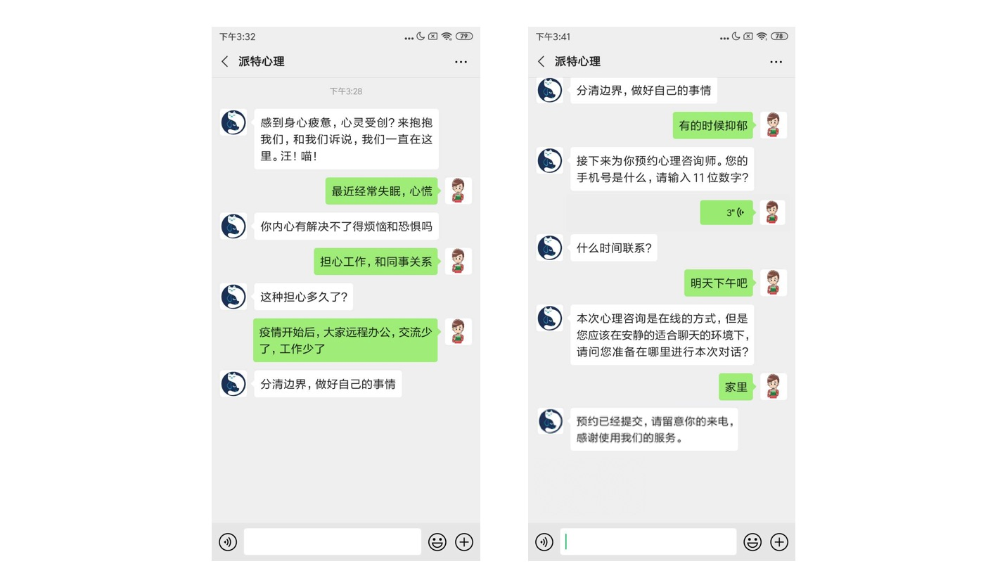

# Emotional First Aid Dataset

心理咨询问答语料库，仅限研究用途。

[https://github.com/chatopera/efaqa-corpus-zh](https://github.com/chatopera/efaqa-corpus-zh)

|                                                                           |                                                                                                       |
| ------------------------------------------------------------------------- | ----------------------------------------------------------------------------------------------------- |
| [数据集介绍](https://github.com/chatopera/efaqa-corpus-zh#数据集介绍)     | [项目背景](https://github.com/chatopera/efaqa-corpus-zh#项目背景)                                     |
| [安装使用](https://github.com/chatopera/efaqa-corpus-zh#安装使用)         | [语料文件](https://github.com/chatopera/efaqa-corpus-zh#语料文件)                                     |
| [在线数据平台](https://github.com/chatopera/efaqa-corpus-zh#在线数据平台) | [心理问答 API](https://github.com/chatopera/efaqa-corpus-zh#%E5%BF%83%E7%90%86%E9%97%AE%E7%AD%94-api) |
| [标注志愿者](https://github.com/chatopera/efaqa-corpus-zh#标注志愿者)     | [媒体报导](https://github.com/chatopera/efaqa-corpus-zh#媒体报导)                                     |
| [声明](https://github.com/chatopera/efaqa-corpus-zh#声明)                 | [联系我们](https://github.com/chatopera/efaqa-corpus-zh#联系我们)                                     |

## 为什么发布这个语料库

心理咨询中应用人工智能，是我们认为非常有意义的一个探索。我们愿意和更多人合作，把目前领先的人工智能技术，在心理咨询不同场景下落地。扣门的，就给他开门，愿每个人都有自己的心理咨询师。

<p align="center">-- <a href="https://mp.weixin.qq.com/s/nYXfWp-J2dB9I-iHLWJEuw">派特心理</a></p>

# 数据集介绍

心理咨询问答语料库（以下也称为“**数据集**”，“**语料库**”）是为应用人工智能技术于心理咨询领域制作的语料。据我们所知，这是心理咨询领域首个开放的 QA 语料库，包括 20,000 条心理咨询数据，也是公开的最大的中文心理咨询对话语料。数据集内容丰富，不但具备多轮对话内容，也有分类等信息，制作过程耗费大量时间和精力，比如标注过程是面向多轮对话，平均每条标记耗时 1 分钟。

数据集由斯坦福大学，UCLA 和台湾辅仁大学临床心理学等心理学专业人士参与建设，并由 Chatopera 和诸多志愿者合作完成。

数据文件位置[efaqa-corpus-zh.utf8.gz](https://github.com/chatopera/efaqa-corpus-zh/blob/master/data/efaqa-corpus-zh.utf8.gz)，该文件为 Gzip 压缩，utf8 编码，每行一条数据，每条为 JSON 格式字符串，格式如下：

<table>
  <tr>
    <th>字段</th>
    <th colspan="3">说明</th>
    <th>类型</th>
  </tr>
  <tr>
    <td>md5</td>
    <td colspan="3">唯一标识</td>
    <td>string</td>
  </tr>
  <tr>
    <td>title</td>
    <td colspan="3">标题</td>
    <td>string</td>
  </tr>
  <tr>
    <td>description</td>
    <td colspan="3">描述</td>
    <td>string</td>
  </tr>
  <tr>
    <td>owner</td>
    <td colspan="3">咨询者（脱敏后）</td>
    <td>string</td>
  </tr>
  <tr>
    <td>label</td>
    <td colspan="3">话题标签</td>
    <td>Object</td>
  </tr>
  <tr>
    <td rowspan="3"></td>
    <td>s3</td>
    <td colspan="2">烦恼类型</td>
    <td>string</td>
  </tr>
  <tr>
    <td>s2</td>
    <td colspan="2">心理疾病</td>
    <td>string</td>
  </tr>
  <tr>
    <td>s1</td>
    <td colspan="2">SOS</td>
    <td>string</td>
  </tr>
  <tr>
    <td>chats</td>
    <td colspan="3">聊天数据</td>
    <td>Array</td>
  </tr>
  <tr>
    <td rowspan="8"></td>
    <td>sender</td>
    <td colspan="2">发布者</td>
    <td>string</td>
  </tr>
  <tr>
    <td>type</td>
    <td colspan="2">消息类型</td>
    <td>string</td>
  </tr>
  <tr>
    <td>time</td>
    <td colspan="2">发布时间</td>
    <td>string</td>
  </tr>
  <tr>
    <td>value</td>
    <td colspan="2">消息文本内容</td>
    <td>string</td>
  </tr>
  <tr>
    <td>label</td>
    <td colspan="2">聊天标签</td>
    <td>Object</td>
  </tr>
  <tr>
    <td rowspan="3"></td>
    <td>knowledge</td>
    <td>知识性</td>
    <td>boolean</td>
  </tr>
  <tr>
    <td>question</td>
    <td>追问</td>
    <td>boolean</td>
  </tr>
  <tr>
    <td>negative</td>
    <td>负面回复</td>
    <td>boolean</td>
  </tr>
</table>

**【注意：】sender 的值是`owner`代表消息是咨询者发送的；值是`audience`代表消息是网友发布的，网友可能是心理咨询师，也可能不是。**

## 数据示例

```
{
  "md5": "2f63d374c071043d9e1968aefa62ffb7",
  "owner": "匿名",
  "title": "女 听过别人最多的议论就是干啥啥不行不长心眼没有脑子",
  "label": {
    "s1": "1.13",
    "s2": "2.7",
    "s3": "3.4"
  },
  "chats": [
    {
      "time": "11:02:45",
      "value": "这样的议论是针对谁呢？",
      "sender": "audience",
      "type": "textMessage",
      "label": { "question": true, "knowledge": false, "negative": false }
    },
    {
      "time": "11:08:38",
      "sender": "audience",
      "type": "textMessage",
      "value": "欢迎你来找我玩❤",
      "label": { "question": false, "knowledge": false, "negative": false }
    },
    {
      "time": "11:15:17",
      "sender": "owner",
      "type": "textMessage",
      "value": "好惨"
    }
  ]
}
```

## 话题标签

一条数据中，`title`和`description`是咨询者咨询的初始信息，话题标签是基于二者将咨询问题进行分类，分类包含三个维度：`S1` 烦恼类型；`S2` 心理疾病；`S3` SOS。其中，`S`代表`severity`，三个维度体现心理问题的严重程度依次加重。**需要强调的是**, 其中一些项目需要临床医学鉴定，数据集所使用概念，均代表**疑似**，比如我们标记了一个话题分类为*抑郁症*，实际上是指*疑似抑郁症*，该声明不代表我们的工作不认真，而是严格的判断的难度以及出于严谨性的考虑。

在`label`中记录的是每个维度子类的 ID，ID 设计如下。

### S1 烦恼类型

| ID   | 中文                               | 英文                          | 备注                                                                                                                                         |
| ---- | ---------------------------------- | ----------------------------- | -------------------------------------------------------------------------------------------------------------------------------------------- |
| 1.1  | 学业烦恼、对未来规划的迷茫         | Academic Concerns             | 学业烦恼包括学习障碍、学习吃力、学习成绩差、注意力不集中和对学习科目无兴趣等。                                                               |
| 1.2  | 事业和工作烦恼                     | Career and Workplace Issues   | 在工作中的，人际冲突问题、沟通问题、谣言、职场骚扰、歧视、动力不足和工作满意度低和职场表现差等问题。                                         |
| 1.3  | 家庭问题和矛盾                     | Family Issues and Conflict    | 家庭问题和矛盾包括家庭暴力、金钱遗产争执、家庭不和睦、婆媳问题、子女们对年长父母看护问题、继父母继子女冲突问题和离异父母对于儿女的养护问题。 |
| 1.4  | 物质滥用                           | Substance Abuse and Addiction | 成人如酗酒、吸烟、药物滥用、吸毒、赌博和任何影响生活品质的上瘾行为。                                                                         |
| 1.5  | 悲恸                               | Grief                         | 由于痛失亲人或朋友而引起的极大悲伤。                                                                                                         |
| 1.6  | 失眠                               | Insomnia                      | 无法入睡或难以保持入睡状态而影响第二天表现的睡眠障碍。                                                                                       |
| 1.7  | 压力                               | Stress                        | 压力是一种情绪上或身体上的紧张感。它可能来自任何使您感到沮丧，愤怒或紧张的事件或想法。                                                       |
| 1.8  | 人际关系                           | Interpersonal Relationship    | 不属于职场、学校以及家庭的人际关系紧张与矛盾。                                                                                               |
| 1.9  | 情感关系问题                       | Relationship Issues           | 早恋、暗恋、异地恋、出轨、吵架、复合、LGBT 群体                                                                                              |
| 1.10 | 离婚                               | Divorce                       | 离婚后情感以及孩子的问题                                                                                                                     |
| 1.11 | 分手                               | Break Up                      | 分手后的痛苦                                                                                                                                 |
| 1.12 | 自我探索                           | Self-Awareness                | 如星座、性格、兴趣等                                                                                                                         |
| 1.13 | 低自尊                             | Low self-esteem               | 低自尊心的表现 自尊是一个人对自己的价值的主观评价。自尊包括对自己以及情绪状态的信念，例如胜利，绝望，骄傲和羞耻。                            |
| 1.14 | 青春期问题                         | Adolescent Problem            | 青春期少年在身心成长上所面临的问题，如叛逆、伤害他人、怀孕、药物滥用和青少年犯罪。                                                           |
| 1.15 | 强迫症                             | OCD                           | 强迫症的人会陷入一种无意义、且令人沮丧的重复的想法与行为当中，但是一直想却无法摆脱它。                                                       |
| 1.16 | 其它                               | Others                        | 其他烦恼，虽然对生活学习没有造成毁灭性的阻碍，但是却依然会引起心里不适。                                                                     |
| 1.17 | 男同性恋、女同性恋、双性恋与跨性别 | LGBT                          | 男同性恋、女同性恋、双性恋与跨性别                                                                                                           |
| 1.18 | 性问题                             | Sex                           | 对于青少年，是性教育不足引起各种社会问题；对于成年人，性焦虑与性上瘾可以演变成生理疾病。                                                     |
| 1.19 | 亲子关系                           | Parent-child relationship     | 亲子关系，从婴幼儿时期就开始影响着孩子各方面的发展，比如性格、毅力、人际交往等等。                                                           |

### S2 心理疾病

心理问题已经影响工作，咨询者需要休息调整或就医。

| ID  | 中文           | 英文             | 备注                                                                                                                                                                 |
| --- | -------------- | ---------------- | -------------------------------------------------------------------------------------------------------------------------------------------------------------------- |
| 2.1 | 忧郁症         | Depression       | 长时间持续的抑郁情绪，并且这种情绪明显超过必要的限度，缺乏自信，避开人群，甚至有罪恶感，感到身体能量的明显降低，时间的感受力减慢，无法在任何有趣的活动中体会到快乐。 |
| 2.2 | 焦虑症         | Anxiety          | 长时间持续性的焦虑情绪，无明确客观对象却依然紧张担心，坐立不安，如心悸、手抖、出汗、尿频、注意力难以集中。                                                           |
| 2.3 | 躁郁症         | Bipolar Disorder | 又称为"双向情感障碍" 。狂躁期：感到生机勃勃、精力充沛以及情感高涨或易被激惹。也可感到过度自信，行为或穿着铺张浪费，睡眠极少且语量增多。                              |
| 2.4 | 创伤后应激反应 | PTSD             | 首先要经历创伤：如孩童时期遭受身体或心理上的虐待；接触相关事物时会有精神或身体上的不适和紧张，创伤的情景会一遍一遍在脑海中重演。                                     |
| 2.5 | 恐慌症         | Panic Disorder   | 又称急性焦虑症，是反复发生的惊恐发作。惊恐发作是突然的短期强烈的恐惧（濒死感），包含心悸、流汗、手颤抖、呼吸困难、麻痹感。                                           |
| 2.6 | 厌食症和暴食症 | Eating Disorder  | 厌食症：吃太少导致体重偏轻；暴食症：大量进食后再想办法吐出来。两种疾病都对"瘦"有着极端的追求，对自己身体不满意，在生活学习上有极端完美主义心态。                     |
| 2.7 | 尚未达到 S2    | Unrelated        | 还没有严重到心理疾病                                                                                                                                                 |
| 2.8 | 其它疾病       | Others           | 已经严重影响生活和工作，甚至生活工作不能进行，但并不能确认是哪一类疾病的情况。                                                                                       |

**【注意：】一些在临床上更为严重的心理疾病，比如多重人格等，因为其复杂性，更不容易判断，数据集暂时不涉及标注。**

### S3 SOS

紧急情况，需要立刻有人工干预。

| ID  | 中文               | 英文             | 备注               |
| --- | ------------------ | ---------------- | ------------------ |
| 3.1 | 正在进行的自杀行为 | Suicide Action   | N/A                |
| 3.2 | 策划进行的自杀行为 | Suicide Ideation | N/A                |
| 3.3 | 自残               | Self-harm        | N/A                |
| 3.4 | 进行的人身伤害     | N/A              | 正在对他人进行伤害 |
| 3.5 | 计划的人身伤害     | N/A              | 计划对他人进行伤害 |
| 3.6 | 无伤害身体倾向     | N/A              | N/A                |

## 聊天标签

| 标记      | 含义                                     |
| --------- | ---------------------------------------- |
| question  | 是否是追问，追问可以让咨询者更多倾诉     |
| knowledge | 是否带有知识，含知识内容有助于开导咨询者 |
| negative  | 负面回复，对咨询者起负面作用             |

## 项目背景

为了帮助更好应用该数据集，特别制作了一个视频帮助了解项目背景、标注设计和标注过程。

<p align="center">
  <b>心理咨询AI助手|派特心理</b><br>
  <a href="https://ke.qq.com/course/2026518?taid=8029943873072150&tuin=6780672d" target="_blank">
      
  </a>
</p>

## 安装使用

### Python

为了方便使用，数据集发布到 [https://pypi.org/project/efaqa-corpus-zh/](https://pypi.org/project/efaqa-corpus-zh/) 上，使用 `pip` 下载安装。

```
pip install efaqa-corpus-zh
```

演示代码

```
import efaqa_corpus_zh
l = list(efaqa_corpus_zh.load())
print("size: %s" % len(l))
print(l[0]["title"])
```

初次执行 `load` 接口，会下载数据，数据在 Github 上，请确保网络可以访问到[https://github.com](https://github.com)。下载速度取决于网络质量，目前数据集压缩包大小~8MB。

### 语料文件

如果您使用其它编程语言，那么直接先下载数据文件[efaqa-corpus-zh.utf8.gz](https://github.com/chatopera/efaqa-corpus-zh/blob/master/data/efaqa-corpus-zh.utf8.gz)，然后使用 Gzip 解压工具解压，得到文本文件，然后按行读取。

## 在线数据平台

为帮助大家更好的使用数据集，我们也录入到不同在线数据平台。

[Kaggle](https://www.kaggle.com/samurais/emotional-first-aid-dataset)

[Baidu AI Studio](https://aistudio.baidu.com/aistudio/datasetdetail/31443)

[天池实验室](https://tianchi.aliyun.com/dataset/dataDetail?dataId=61868)

## 心理问答 API

作为心理咨询平台，心理健康服务开发者，如何获得智能问答服务呢？如果不想从零开始，有没有成熟的方案呢？我们称之为`心理问答 API`。伴随着我们标注数据量的累积，我们也在完善利用这些数据研发的对话服务，现在已经在`Chatopera云服务`内上线，通过使用 SDK，几行代码立刻接入`心理问答 API`。

`心理问答 API` 包括`单轮对话`和`多轮对话`，详细使用文档参考[https://docs.chatopera.com/products/psych-assistant/api.html](https://docs.chatopera.com/products/psych-assistant/api.html)。



[心理问答机器人示例程序](https://github.com/chatopera/efaqa-bot-demo)：

```
https://github.com/chatopera/efaqa-bot-demo
```


## 标注志愿者

本语料有相当一部分是网络招募志愿者完成，而且不乏心理学专业人士，或者对心理学有浓厚兴趣的爱心人士，出于对数据质量的严格要求，我们的招募过程是认真对待的，加入的志愿者也是非常积极的，在此特别感谢他们的贡献！他们不辞辛苦，愿意为人工智能技术应用于心理咨询行业日夜工作，终于有了这个数据集！

志愿者成员信息: [https://github.com/chatopera/efaqa-corpus-zh/wiki/Volunteers](https://github.com/chatopera/efaqa-corpus-zh/wiki/Volunteers)，大家分布在中国大陆、法国、美国和加拿大，标注工作占据了大家很多闲暇时间和休息时间，对此表达特别敬意！

同时，现在我们依然在招募志愿者，招募介绍 [https://github.com/chatopera/efaqa-corpus-zh/wiki](https://github.com/chatopera/efaqa-corpus-zh/wiki)。

## 媒体报导

[52NLP: Emotional First Aid Dataset, 心理咨询问答语料库](http://www.52nlp.cn/)

[开源社：上线！Chatopera 首发开源心理咨询对话语料库](https://mp.weixin.qq.com/s/AyfWPBRQszKLCvT-YEFxMw)

[通向心理咨询的未来之路|派特心理](https://zhuanlan.zhihu.com/p/128632328)

[派特心理：招募心理咨询语料标注志愿者](https://zhuanlan.zhihu.com/p/116508541)

## 声明

### 声明 1:

本数据集使用在线心理咨询数据清洗、脱敏和标注制作，数据及代码发布使用 GPL 3.0 许可协议。数据仅限于研究用途，如果在发布的任何媒体、期刊、杂志或博客等内容时，必须注明引用和地址。无授权商业用途，追究版权。

```
@online{efaqa-corpus-zh:petpsychology,
  author = {Hai Liang Wang, Zhi Zhi Wu, Jia Yuan Lang},
  title = {派特心理：心理咨询问答语料库},
  year = 2020,
  url = {https://github.com/chatopera/efaqa-corpus-zh},
  urldate = {2020-04-22}
}
```

### 声明 2:

语料库为主观标注，鉴于心理咨询的严肃性和重要性，语料制作时尽可能保证数据的准确性，但是无法保证 100%准确，对于因数据内容不当产生的后果，本团队不承担任何法律责任。

Emotional First Aid Dataset, Chatopera Inc., https://github.com/chatopera/efaqa-corpus-zh, Apr. 22th, 2020

## GPL 3.0 许可协议

Emotional First Aid Dataset, only for Research.
Copyright (C) 2020 北京华夏春松科技有限公司 <https://chatopera.com>

This program is free software: you can redistribute it and/or modify
it under the terms of the GNU General Public License as published by
the Free Software Foundation, either version 3 of the License, or
(at your option) any later version.

This program is distributed in the hope that it will be useful,
but WITHOUT ANY WARRANTY; without even the implied warranty of
MERCHANTABILITY or FITNESS FOR A PARTICULAR PURPOSE. See the
GNU General Public License for more details.

You should have received a copy of the GNU General Public License
along with this program. If not, see <http://www.gnu.org/licenses/>.

## 联系我们

获得更多数据用于研究或商业产品等事项

联系方式查看[https://www.chatopera.com/mail.html](https://www.chatopera.com/mail.html)。

[![chatoper banner][co-banner-image]][co-url]

[co-banner-image]: https://user-images.githubusercontent.com/3538629/42383104-da925942-8168-11e8-8195-868d5fcec170.png
[co-url]: https://www.chatopera.com
